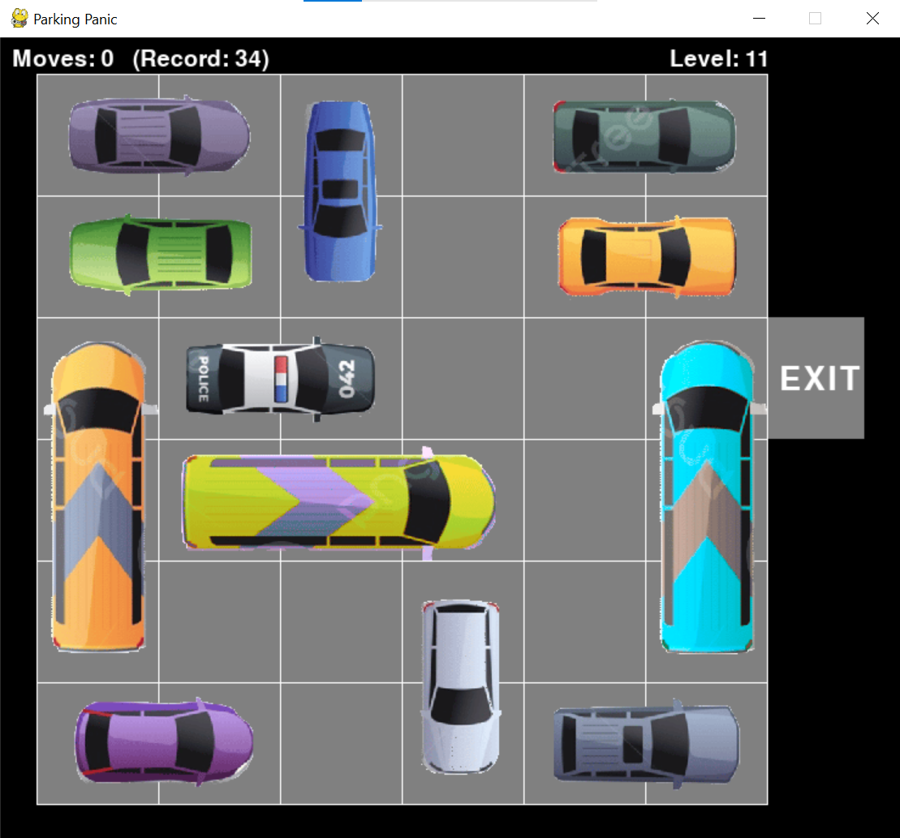

# Parking Panic

## Introduction
Parking Panic is a puzzle game inspired by a crowded parking lot. The objective of the game is to strategically move cars within a parking lot to clear a path for the target car to exit. The game was implemented in Python using the pygame module, drawing inspiration from both an online game and a board game.

## Project Structure
The project follows a modular structure with the main components including:
- `parking_panic.py`: The entry point of the game, handling the game loop and user input.
- `src/`:
  - `engine.py`: A custom module containing the game logic, such as the parking lot grid, car movements, and victory conditions.
  - `pygame_module.py`: A custom module containing functions specific to the Parking Panic game.
  - `intro_screen.py`: A custom module containing functions related to the game intro screen and level selection.

## Challenges and Solutions
Implementing a game like Parking Panic comes with several challenges, including designing the game logic, managing the parking lot grid, handling user input for car movements, implementing graphics and user interface elements, and thorough testing to ensure a polished and bug-free experience. It's noted that the individual vehicle layouts were supplied for this task, eliminating the need to design and test them for solvability.

## GUI
The GUI of the game includes a parking lot grid where the goal is to free a specific car (e.g., a police car) to allow it to leave the parking lot. The top of the screen displays a step counter and the best record so far for the level.

## How to Run
1. Clone this repository to your local machine.
2. Install Python and pygame if you haven't already.
3. Navigate to the directory where the repository is cloned.
4. Run `python parking_panic.py` to start the game.

## Credits
- [Online game](https://www.coolmathgames.com/0-parking-panic)
- [Board game](https://www.thinkfun.com/products/rush-hour/)
